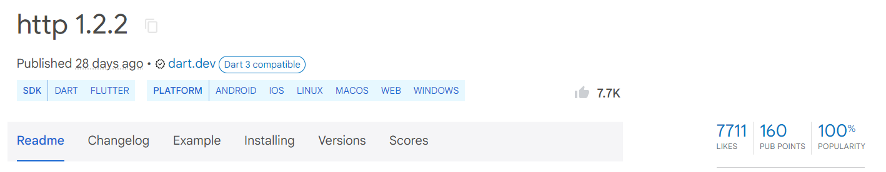

# 01. Entendendo pacotes e requisições


## Apresentação

Boas-vindas ao curso de Dart: Fundamentos de Assincronismo e Comunicação com APIs.

- O projeto que desenvolveremos nesse curso será de **banco**. 
- Precisaremos lidar com as **contas** desse banco, incluindo o nome da pessoa e o saldo disponível. 
- No entanto, não armazenaremos essas informações localmente em nosso computador ou projeto e sim em **servidor externo**.
- O resultado será um **chatbot** que, ao clicarmos em "ver contas", por exemplo, ele busca as informações no servidor e as exibe na tela.

Esses conhecimentos de API, Post, Get, comunicação através de Map, JSON, assincronismo e como preparar o Dart para lidar com operações que podem demorar, como manipular o Token e até mesmo criar uma interação com o chatbot, são essenciais no mercado.


## Preparando o ambiente

### 1. Sobre o projeto

Neste curso começaremos um projeto do zero.

Lembre-se também que, como o "back-end" que nos comunicaremos nesse curso é um **GIST**, você precisa fazer uma **conta GitHub** e **configurar o seu Gist**.

## 2. O que eu preciso ter instalado na minha máquina?

Antes de qualquer coisa, é necessário ter uma IDE (ou editor de texto), que pode ser o [VSCode](https://code.visualstudio.com/), IntelliJ Community, ou outra de sua preferência, instalada e [configurada para o Dart/Flutter](https://docs.flutter.dev/get-started/editor) na sua máquina.

Também é essencial que você tenha as versões do Dart e do Flutter instaladas na sua máquina:

- [SDK do Flutter](https://docs.flutter.dev/get-started/install), preferencialmente, na versão 3.16.9.
- Dart, preferencialmente, na versão 3.2.6.

## 3. Criando seu `Gist`

Neste projeto, o nosso "back-end", nosso "servidor", nosso "banco de dados na nuvem", será um **Gist do GitHub**. Nele solicitaremos informações que estão na nuvem usando Dart, e também editaremos essas informações.

O `Gist`, do GitHub, é uma ferramenta que permite **compartilhar trechos de código** ou **qualquer tipo de arquivo textual** de forma rápida e simples.

Ele funciona como uma **versão simplificada de um repositório Git**, onde você pode criar e armazenar pequenos arquivos, públicos ou privados, que podem ser **facilmente compartilhados por meio de um link**.

Além de ser uma ferramenta útil para colaborar e compartilhar snippets de código, o Gist também **permite versionamento e comentários**, facilitando a revisão e o aprimoramento de código de forma colaborativa.

Para dar prosseguimento ao nosso curso, precisamos que você gere um arquivo `accounts.json` em um `Gist` de sua propriedade, para isso:

1. Assegure-se de possuir e entrar com uma conta [GitHub](https://github.com/signup);

2. Acesse [Create a new `Gist`](https://gist.github.com/);

3. Tanto nos campos *"Gist description…"*, quanto em *"Filename including extension…"* escreva `accounts.json`;

4. No campo de texto em branco, adicione o seguinte texto:
```json
[
    {
        "id": "ID001",
        "name": "Ricarth",
        "lastName": "Lima",
        "balance": 113.0
    },
    {
        "id": "ID002",
        "name": "Ana",
        "lastName": "Silva",
        "balance": 250.0
    },
    {
        "id": "ID003",
        "name": "Bruno",
        "lastName": "Santos",
        "balance": 75.0
    },
    {
        "id": "ID004",
        "name": "Carla",
        "lastName": "Oliveira",
        "balance": 500.0
    },
    {
        "id": "ID005",
        "name": "Daniel",
        "lastName": "Ferreira",
        "balance": 180.0
    },
    {
        "id": "ID006",
        "name": "Elisa",
        "lastName": "Costa",
        "balance": 320.0
    },
    {
        "id": "ID007",
        "name": "Fábio",
        "lastName": "Pereira",
        "balance": 60.0
    },
    {
        "id": "ID008",
        "name": "Gabriela",
        "lastName": "Rodrigues",
        "balance": 200.0
    },
    {
        "id": "ID009",
        "name": "Henrique",
        "lastName": "Martins",
        "balance": 450.0
    },
    {
        "id": "ID010",
        "name": "Isabela",
        "lastName": "Almeida",
        "balance": 210.0
    }
]
```

5. Clique na seta verde ao lado de *"Create secret gist"* e selecione *"Create public gist"*, e então clique no botão verde que agora tem escrito *"Create public gist"*;

6. Na tela que abriu, clique no botão *"Raw"* para obter a URL que usaremos no curso:

7. Copie a URL no campo do navegador.


## Instalando pacote `http`

Com o arquivo em mãos, surge a questão de *como trazer essa informação da web para aplicação Dart?*. É importante destacar que servidores de aplicações, como o GitHub, fornecem algo chamado **API**, que são **interfaces de programação para aplicações**.

As APIs permitem que **acessemos informações armazenadas em servidores**, não por meio do navegador, mas através de nossas aplicações e programas. Elas são uma solução de engenharia de software que possibilita a **comunicação com sistemas externos**.

### Pacotes no Dart e Flutter para integração de APIs

Embora possa parecer complexo integrar informações de um ambiente externo ao nosso sistema, não precisamos nos preocupar com isso. A solução está em **pacotes**, **bibliotecas** ou **plugins**, que variam de nome conforme a linguagem ou stack.

No caso do Dart e Flutter, **usamos pacotes**. Eles são **trechos de código desenvolvidos por terceiros, amplamente testados, que resolvem problemas específicos**. Um desses pacotes facilita a obtenção de dados de APIs, como o Gist, e funciona tanto no Dart quanto no Flutter.

Para fazermos isso, primeiro precisamos acessar o `accounts.json` no Gist. Após, na lateral superior direita da tela, clicamos no botão *"Raw"*, assim, visualizamos o arquivo.

### Criando um projeto Dart no VS Code

Agora, criaremos um projeto do zero no VS Code. Para isso, abrimos a ferramenta e pressionamos o botão `F1`. Assim, abre a barra de busca, na qual digitamos `>dart`. Clicamos na opção `Dart: New Project`.

Assim, a ferramenta exibe várias opções de tipos de projeto. Nesse momento, queremos uma **aplicação de console que rodará no terminal**, então, clicamos em `Console aplication`.

Nisso, a ferramenta pede para **selecionarmos uma pasta**, selecionamos a pasta da formação clicamos no botão `Select a folder to create the project in`.

Precisamos definir um **nome para o arquivo**. Nesse caso, temos preferência por colocar o **nome da tecnologia**, seguido pelo **nome significativo**. Nomeamos de `dart_assincronismo`.

Ao criar o projeto, encontramos a pasta `/bin`, o arquivo que criamos com a `main` e a pasta `/lib` para futuramente inserirmos arquivos que se comunicarão com a bin.

Faremos agora alguns ajustes. Clicamos no primeiro arquivo chamado `dart_assiscronismo.dart`, pressionamos `F2` e **renomeamos** para `main.dart`.

Feito isso, todo o código que veio nesse arquivo, selecionamos e apagamos. Depois, salvamos o arquivo. 

Para evitar que erros aconteçam na pasta "test", selecionamos o arquivo `dart_assincronismo_test.dart` e pressionamos `Delete` **para apagar**. Faremos o mesmo com o arquivo `dart_assincronismo.dart` que está na pasta `/lib`.

Assim, temos apenas o arquivo `main.dart`. Nele, escrevemos `void main(){}`, nas chaves, passamos `print("Olá, mundo")`. Fazemos isso para testar se a limpeza que fizemos funcionou.

Abrimos o terminal com `Ctrl + J` e passamos o comando `dart run bin/main.dart`.

```sh
dart run bin/main.dart
```
```
Olá, mundo!
```

### Instalando o pacote HTTP no projeto

Deu certo, temos o retorno que passamos. 

Mas, para instalar o pacote necessário, passaremos o comando `dart pub add http`, que **adiciona o pacote HTTP ao projeto**.

```sh
dart pub add http
```

Feito isso, é baixado e adicionado na nossa aplicação. Já temos o HTTP para usar no código. Para confirmar se ele foi mesmo instalado, no Explorer, **acessamos o arquivo** `pubspec.yaml`.

Esse é o arquivo que **controla as dependências**, ou seja, os pacotes que nosso programa depende no Dart.


## Para saber mais: biblioteca, pacote, plugin, dependência?

Bibliotecas, dependências, pacotes e plugins são conceitos fundamentais para o desenvolvimento de software

### Bibliotecas

Uma biblioteca é um **conjunto de códigos prontos** que oferece **funcionalidades específicas** que você pode reutilizar em seus projetos. Você pode pensar nela como uma **caixa de ferramentas**: ao invés de criar todas as ferramentas do zero, você **usa as que já foram feitas por outras pessoas**. Se você precisa manipular datas, por exemplo, em vez de criar funções para calcular o tempo entre dois dias, você pode usar uma biblioteca que já faz isso.

No Dart, as bibliotecas são **coleções de códigos Dart que podem ser importadas** para o seu projeto para fornecer funcionalidades adicionais. Um exemplo é a **biblioteca dart:math**, que fornece **funções matemáticas**.

### Pacotes

Um pacote é uma **coleção de bibliotecas**, arquivos e recursos organizados em uma estrutura específica. Pacotes **podem conter uma única biblioteca ou várias bibliotecas**, além de **documentação, exemplos e outros arquivos úteis**.

No contexto do Dart e Flutter, pacotes **são distribuídos** através do **[pub.dev](https://pub.dev/)** e podem ser facilmente adicionados ao seu projeto como **dependências**.

Existem pacotes para as **mais diversas funcionalidades** (sem exagero, tem para quase tudo), como manipulação de JSON, integração com APIs, e até pacotes que fornecem widgets prontos para Flutter. O **pacote http**, por exemplo, fornece bibliotecas que **ajudam a fazer requisições HTTP em Dart**.

### Plugins

Plugins são um tipo de pacote que **permite que seu código Dart interaja com funcionalidades nativas** do sistema operacional, como a câmera, GPS, ou sensores do dispositivo.

No Flutter, os plugins são importantes para acessar esses **recursos em plataformas como Android e iOS**. Na verdade, plugins só existem para o Dart no contexto do Flutter, um exemplo bom seria um **plugin de câmera** que permite que você use, claro, a câmera do dispositivo em um aplicativo Flutter. Ele contém código Dart que se comunica com as APIs nativas da câmera no Android e iOS.

### Dependências

Dependências são **bibliotecas externas** que seu projeto precisa para funcionar corretamente. Quando você desenvolve um software, pode ser que você não queira ou não precise reinventar a roda. Ao invés disso, você adiciona ao seu projeto dependências que outras pessoas já criaram, economizando tempo e esforço.

Essas dependências também são gerenciadas pelo pub.dev, e você pode **definí-las no seu projeto através do arquivo** `pubspec.yaml`, e o Dart ou Flutter cuida de baixar e instalar essas dependências.

Ou seja, *bibliotecas, pacotes e plugins que são externos ao seu código* (e dos quais o seu código dependem) *são considerados "dependências"*.

[Como gerenciar pacotes e dependências](https://dart.dev/guides/packages)


## Para saber mais: conhecendo o pub.dev

O [pub.dev](https://pub.dev/) é o **repositório oficial** de pacotes para Dart e Flutter, onde você encontra **diversas bibliotecas**, **ferramentas** e **plugins** que podem ser integrados ao seu projeto.

### Dados importantes na página principal do pacote

Quando você **abre um pacote**, essa é a página inicial que encontrará:



> Pacote HTTP na versão 1.2.2, publicado há 28 dias, compatível com Dart 3, com 7.7K curtidas, 7711 likes, 160 pontos no Pub e 100% de popularidade.

- **Data da última atualização**:
  - Informa quando o pacote foi atualizado pela última vez. *Manutenções recentes indicam que o pacote está ativo e compatível com as versões mais recentes* do Dart ou Flutter, o que pode evitar problemas de compatibilidade.
  
- **Publisher**:
  - É a organização ou pessoa responsável por manter o pacote. **Pacotes publicados por entidades oficiais**, como `dart.dev` ou `flutter.dev`, ou por desenvolvedores conhecidos são, em geral, mais confiáveis.

- **SDK**:
  - Esse campo especifica **se o pacote ou plugin é compatível** só com Dart, só com Flutter ou com ambos os SDKs. É importante verificar essa informação para garantir que o pacote funcionará corretamente no seu ambiente de desenvolvimento.

- **Platform**:
  - Mostra as **plataformas suportadas** pelo pacote, como web, android, ios, macos, windows, e linux. Saber para quais plataformas o pacote é compatível ajuda a decidir se ele atende às necessidades específicas do seu projeto.

- **Likes, pub points e popularidade**:
  - **Likes**: representa a quantidade de *"curtidas"* que o pacote recebeu da comunidade, indicando sua aceitação e qualidade.
  - **Pub points**: avalia a *qualidade técnica do pacote*, levando em conta fatores como a consistência do código, presença de documentação, e conformidade com as práticas recomendadas.
  - **Popularidade**: reflete o *engajamento da comunidade* com o pacote, baseado em métricas como o número de downloads e a utilização em projetos.

### Explorando as páginas do pacote no pub.dev

- **Readme**
  - É a **primeira página** que você verá ao acessar um pacote no pub.dev. Ela contém uma **introdução ao pacote**, explicando **o que ele faz** e **como pode ser útil**.
  - Frequentemente, inclui **instruções básicas de uso**, **exemplos rápidos de código**, e links para documentação mais detalhada. Ler a Readme é essencial para **entender rapidamente** se o pacote atende às suas necessidades.

> Página de documentação do pacote HTTP na versão 1.2.2, publicada pela dart.dev. A página descreve o pacote como uma biblioteca baseada em Future para fazer requisições HTTP, com suporte multiplataforma e exemplos de uso prático para requisições HTTP simples.

- **Changelog**
  - Essa página documenta as **alterações feitas em cada versão** do pacote. Isso inclui **novas funcionalidades**, correções de bugs e alterações que podem quebrar compatibilidade (breaking changes).
  - **Revisar o changelog é fundamental** ao utilizar um pacote, para garantir que as mudanças não afetem negativamente seu projeto.

> Registro de mudanças do pacote HTTP, mostrando as atualizações feitas desde a versão 1.1.0 até a versão 1.2.2. As atualizações incluem ajustes de compatibilidade com versões específicas de Dart e outros pacotes, adição de novas funcionalidades como a capacidade de obter headers como um mapa em BaseResponse e melhorias de mensagens de erro.

- **Example**
  - Essa aba fornece **exemplos práticos** de como usar o pacote, que são geralmente **trechos de código ou projetos completos** que mostram como implementar as funcionalidades do pacote no seu próprio código.
  - Essa seção é muito útil para quem está começando a usar o pacote e quer **entender rapidamente como integrá-lo** ao projeto.

> Exemplo de código Dart utilizando a biblioteca HTTP para fazer uma requisição GET à API do Google Books. O código demonstra como enviar uma requisição, decodificar a resposta JSON e extrair o número total de itens (livros) encontrados relacionados ao termo de pesquisa "http".

- **Installing**
  - Aqui encontramos instruções detalhadas sobre **como adicionar o pacote ao seu projeto**. Normalmente, inclui o comando a ser adicionado ao `pubspec.yaml`, e pode também fornecer instruções adicionais para configurar o ambiente ou resolver dependências.
  - É o **primeiro passo** para começar a utilizar o pacote.

> Instruções para instalação da biblioteca HTTP em projetos Dart ou Flutter. O guia mostra os comandos necessários para adicionar a dependência ao arquivo `pubspec.yaml` e como utilizar o gerenciador de pacotes para atualizar as dependências do projeto. 

- **Versions**
  - Essa página **lista todas as versões do pacote** que foram publicadas no pub.dev. Você pode escolher uma versão específica para o seu projeto, o que pode ser necessário se você precisar de uma versão que seja compatível com outras dependências ou se estiver mantendo um projeto legado.
  - Também é possível **ver as notas de versão** para entender o que mudou em cada atualização.

> Lista de versões estáveis da biblioteca HTTP, mostrando as versões com suporte a null safety, a versão mínima do SDK Dart necessária e a data de publicação de cada uma delas.

- **Scores**
  - Aqui é apresentada uma **análise detalhada do pacote**, baseada em critérios como qualidade do código, documentação, manutenção e adesão às práticas recomendadas.
  - O Score ajuda a **determinar se o pacote é uma boa escolha** para o seu projeto, considerando esses fatores.

> Pontuação do pacote HTTP, mostrando 7711 likes, 160/160 pub points e 100% de popularidade. A análise indica conformidade com as convenções de arquivos Dart, documentação fornecida, suporte a plataforma, análise estática passada e dependências atualizadas suportadas.


## Primeira requisição para web

Instalamos o pacote `http`, que nos ajudará a **realizar a comunicação com o Gist**. Porém, pode surgir a seguinte dúvida: *de onde vem esse pacote?*

### Usando pacotes no Dart

### Acessando o repositório pub.dev

Com o **navegador** aberto, acessaremos uma **página extremamente importante** para pessoas desenvolvedoras que trabalham com Dart e Flutter aberta: o [pub.dev](https://pub.dev/).

O **pub.dev** o **repositório oficial de pacotes do Dart e do Flutter**, construído **pelo Google**, que é responsável pelo Flutter e pelo Dart. É neste **site que buscamos pacotes** (no nosso caso, o `http`).

### Buscando o pacote http
O primeiro pacote listado ao buscarmos por "http" é o `http`.

> Antes do pacote `http`, temos o pacote recomendado dart:core, mas, normalmente, não focamos diretamente nele. Instalaremos de fato o segundo pacote listado.

Nesta página, encontramos **todas as informações sobre o pacote**. Entender isso é crucial, pois, conforme surgem necessidades de terceirizar ações, recorremos a esse recurso frequentemente.

Na vida de uma pessoa programadora, é **inviável programar tudo do zero**. Muitas vezes, **programar usando pacotes de outras pessoas é mais rápido e seguro**, pois já foi amplamente testado.

Como em uma pesquisa no Google, é necessário saber **identificar o que é confiável ou não**.

### Importando o pacote `http`

Feito isso, vamos **voltar ao código** para usar, de fato, o pacote `http`. Com o arquivo main.dart aberto, começaremos pela importação do pacote, pois ele ainda não está presente.

No topo do código, faremos um `import` seguido de `http`. Dentro do pacote `package:http/`, há vários arquivos. Nesse caso, queremos importar apenas o arquivo chamado `http.dart`.

```dart
// main.dart:

import 'package:http/http.dart';

void main() {
  print("Olá, mundo!");
}
```

**Observação**: Nesse momento, *o pacote aparecerá em amarelo, pois foi importado*, mas ainda não está em uso. Isso é importante pois, ao importar um pacote, o arquivo final fica mais pesado e um pouco mais difícil de carregar. Assim, caso o pacote não esteja sendo usado, há um desperdício de recursos.

### Criando a função `requestData()`

Para usar o pacote, após a função `main()`, vamos declarar a função `requestData()`, **responsável pela requisição de dados**. Ela poderia receber qualquer nome, mas chamaremos dessa forma.

No escopo desta função, **começaremos estabelecendo a URL** que será utilizada para requisitar os dados, ou seja, para **qual URL o pacote irá apontar**. Para isso, criaremos uma `String` chamada `url`, que, por enquanto, receberá uma string vazia (`""`).

```dart
import 'package:http/http.dart';

void main() {
  print("Olá, mundo!");
}

requestData() {
  String url = "";
}
```

Para **obter a URL**, podemos **voltar ao navegador**, onde temos o arquivo `accounts.json` aberto no **GitHub**. Basta **copiar o endereço da barra de navegação** e compor a `String url`.

```dart
// código omitido

requestData() {
  String url = "https://gist.githubusercontent.com/ricarthlima/a0eb198cb7a70696c4031e7e577de0cd/raw/356ce2c39dfd58d3d2e948d1ad87ea828544f1db/accounts.json";
}
```

### Utilizando o método `get()`

Agora que temos a `url`, podemos usar uma função do pacote `http` chamada `get()`, que **significa pegar, capturar, ou requisitar.** A função `get()` não estaria disponível se não tivéssemos importado a biblioteca `http` anteriormente. Podemos até mesmo fazer um teste:

A **função solicita um objeto do tipo `Uri`**, que é a `url`. Portanto, a URL passada como String não funciona nesse caso. Essa é uma convenção sobre como nos comunicamos usando programação na web: para isso, utilizamos **objetos `Uri`**, que basicamente **dividem a `String` em partes**.

> Por exemplo: o **host é quem está no início na URL**, enquanto o **endpoint está no final**. O próprio objeto faz esse trabalho de divisão. No entanto, para não precisarmos fazer a conversão manualmente, existe uma forma automática de trabalhar com isso.

**No método `get()`**, em vez de passar `url`, vamos chamar um objeto `Uri`, que possui um **construtor chamado parse (`Uri.parse()`)**. O `parse()` está preparado para receber uma URL em formato de `String` e **convertê-la para o formato `Uri`**. Com isso, passamos `url` para `parse()`.

```dart
// código omitido

requestData() {
  String url = "https://gist.githubusercontent.com/ricarthlima/a0eb198cb7a70696c4031e7e577de0cd/raw/356ce2c39dfd58d3d2e948d1ad87ea828544f1db/accounts.json";
  get(Uri.parse(url));
}
```

Para finalizar, precisamos **chamar a função `requestData()`** no escopo de `main()`:

Nesta etapa, também podemos **comentar a linha do `print()`** de "Olá, mundo!".

```dart
import 'package:http/http.dart';

void main() {
  // print("Olá, mundo!");
  requestData();
}

// código omitido
```

Agora, o **método `get()` é responsável por pegar o que está no arquivo `accounts.json`** nos servidores do GitHub e **trazer para a nossa aplicação**. Vamos imprimir para verificar se funciona de fato?

### Testando o código

Ainda na mesma linha, **envolveremos o método `get()` com um `print()`**.

```dart
import 'package:http/http.dart';

void main() {
  // print("Olá, mundo!");
  requestData();
}

requestData() {
  String url = "https://gist.githubusercontent.com/ricarthlima/a0eb198cb7a70696c4031e7e577de0cd/raw/356ce2c39dfd58d3d2e948d1ad87ea828544f1db/accounts.json";
  print(get(Uri.parse(url)));
}
```

Feito isso, vamos **abrir o terminal** com o atalho **"Ctrl + J"** e executar o seguinte comando:

```sh
dart run bin/main.dart
```

Como **retorno**, recebemos a seguinte resposta:

```
Instance of Future<Response> (ou "Instância de Future<Response>")
```

### Conclusão

Não é exatamente isso que esperávamos. Um ponto positivo é que **não houve erro**, mas também não recebemos as informações das contas das pessoas usuárias do nosso banco. Portanto, precisamos fazer um tratamento, e o segredo está na palavra "Future" (futuro).

